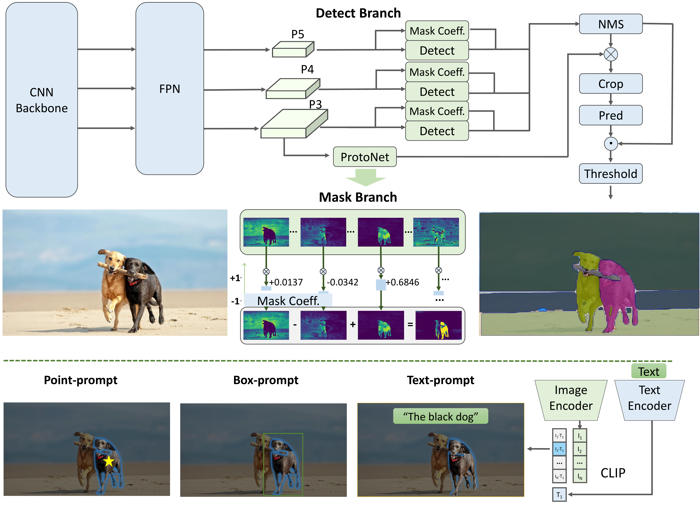

# Fast Segment Anything

[[`📕Paper`](https://arxiv.org/pdf/2306.12156.pdf)] [[`🤗HuggingFace Demo`](https://huggingface.co/spaces/An-619/FastSAM)] [[`Colab demo`](https://colab.research.google.com/drive/1oX14f6IneGGw612WgVlAiy91UHwFAvr9?usp=sharing)] [[`Replicate demo & API`](https://replicate.com/casia-iva-lab/fastsam)] [[`Model Zoo`](#model-checkpoints)] [[`BibTeX`](#citing-fastsam)]


The **Fast Segment Anything Model(FastSAM)** is a CNN Segment Anything Model trained by only 2% of the SA-1B dataset published by SAM authors. The FastSAM achieve a comparable performance with
the SAM method at **50× higher run-time speed**.



**🍇 Refer from**

`Original` : https://github.com/CASIA-IVA-Lab/FastSAM

`model conversion` : https://github.com/ChuRuaNh0/FastSam_Awsome_TensorRT

## Export ONNX
```
    # You can re-config pt2onnx.sh
    bash pt2onnx.sh
    or
    python pt2onnx.py
```


## ONNX Convert TRT
```
    bash onnx2trt.sh
```
It is recommended to install [tensorRT](https://developer.nvidia.com/tensorrt) in advance

## TensorRT Inference
In `CMakeLists.txt` line 24~26 , please modify the tensorRT path as required

```
    # TensorRT
    set(TensorRT_INCLUDE_DIRS /home/xxx/TensorRT-8.4.1.5/include)
    set(TensorRT_LIBRARIES /home/xxx/TensorRT-8.4.1.5/lib)
```
Then terminal execute

```
    mkdir build
    cd build
    cmake ..
    make -j8
    cd bin
    ./fastsam_test -m /home/sp/projects/fastsam/models/fast_sam_x.engine \
                    -i /home/sp/projects/fastsam/images/cat.jpg \
                    -s /home/sp/projects/fastsam/outputs/obj.png
```


